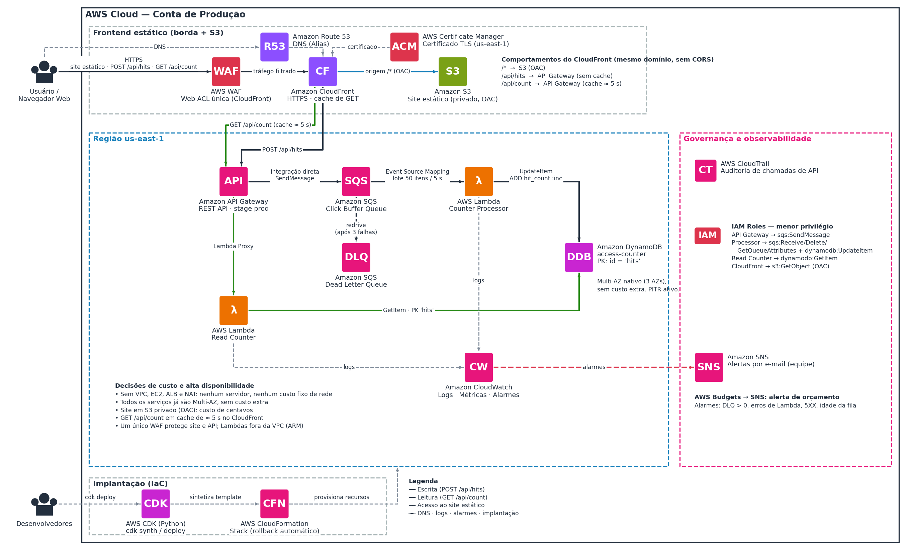

# Contador de Acessos

Um contador de interessados para uma página "Em Breve", feito 100% serverless na AWS.


-blue)


> **Em uma frase:** o visitante clica em "Tenho interesse", o clique entra numa fila, uma função soma os cliques em lote e guarda o total num banco de dados, e a página consulta esse total para mostrar na tela.

## Sumário

1. [O que é este projeto](#1-o-que-é-este-projeto)
2. [O desafio](#2-o-desafio)
3. [Visão geral da arquitetura](#3-visão-geral-da-arquitetura)
4. [Como funciona, passo a passo](#4-como-funciona-passo-a-passo)
5. [Serviços AWS usados e por quê](#5-serviços-aws-usados-e-por-quê)
6. [Decisões de projeto](#6-decisões-de-projeto)
7. [Segurança](#7-segurança)
8. [Alta disponibilidade](#8-alta-disponibilidade)
9. [Custos (estimativa)](#9-custos-estimativa)
10. [Limitações e pontos de atenção](#10-limitações-e-pontos-de-atenção)
11. [Roteiro do projeto](#11-roteiro-do-projeto)
12. [Estrutura do repositório](#12-estrutura-do-repositório)
13. [Perguntas frequentes](#13-perguntas-frequentes)
14. [Glossário](#14-glossário)

---

## 1. O que é este projeto

Uma startup de marketing vai lançar um produto novo e criou uma página de "Em Breve". Ela quer mostrar quantas pessoas já demonstraram interesse, mas não sabe se vai receber 10 ou 1 milhão de acessos.

Por isso, a solução precisa ser:

- **Sem servidor para cuidar:** ninguém precisa atualizar, corrigir ou dimensionar máquinas.
- **Barata:** paga-se pelo uso, e quase nada quando ninguém acessa.
- **Elástica:** cresce sozinha quando o movimento aumenta e encolhe quando ele passa.

Este repositório reúne a arquitetura que desenhamos na AWS para resolver isso, a documentação com a justificativa de cada escolha e, nas próximas fases, o código que cria tudo automaticamente.

## 2. O desafio

O case pedia uma solução com três peças principais:

| Peça | Papel no case |
|---|---|
| **Amazon API Gateway** | A porta de entrada que recebe o clique do usuário |
| **AWS Lambda** | O código que roda só quando é chamado e soma +1 no banco |
| **Amazon DynamoDB** | O banco de dados que guarda o total de acessos |

E três pontos de atenção:

- **Permissões (IAM):** por padrão, nada na AWS conversa com nada. Cada serviço só pode fazer o que foi explicitamente autorizado.
- **Partition Key:** no DynamoDB usamos uma chave fixa (`id = "hits"`), já que existe um único contador.
- **Infraestrutura como código:** o ambiente é criado com o AWS CDK (usamos Python).

Partimos desse núcleo e evoluímos o desenho em algumas versões até chegar à arquitetura final descrita abaixo. As principais mudanças foram adicionar uma fila entre a API e o banco (para aguentar picos), colocar o CloudFront na frente de tudo (um único ponto de entrada) e trocar o servidor do site por um site estático em S3.

## 3. Visão geral da arquitetura



*Seta preta: escrita. Verde: leitura. Azul: acesso ao site estático. Tracejada: DNS, logs, alarmes e implantação.*

A arquitetura se divide em quatro blocos:

- **Frontend estático (borda + S3):** Route 53, ACM, WAF, CloudFront e um bucket S3 privado com os arquivos do site.
- **Backend serverless (us-east-1):** API Gateway, fila SQS (e fila de falhas), duas funções Lambda e a tabela DynamoDB. Nada disso usa VPC.
- **Governança e observabilidade:** CloudWatch (logs e alarmes), SNS (avisos por e-mail), CloudTrail (auditoria), IAM (permissões) e AWS Budgets (alerta de custo).
- **Implantação:** o CDK gera o template e o CloudFormation cria toda a infraestrutura, inclusive o upload do site para o S3.

O diagrama editável está em [`docs/arquitetura-final.drawio`](docs/arquitetura-final.drawio) (abre no [draw.io](https://app.diagrams.net)).

> **Sobre o WAF no desenho:** ele aparece "na frente" do CloudFront só para facilitar a leitura. Na prática, é uma Web ACL associada à distribuição do CloudFront e vale para todas as requisições, tanto do site quanto da API.

## 4. Como funciona, passo a passo

O S3 só guarda e entrega os arquivos do site. Quem leva a informação até o banco é o JavaScript que roda no navegador, chamando a API **no mesmo domínio**. Por isso o API Gateway não se conecta ao S3.

São dois caminhos independentes, os dois servidos pelo CloudFront:

| Caminho | O que trafega | Origem | Cache |
|---|---|---|---|
| `/*` (site) | HTML, CSS, JavaScript, imagens | Amazon S3 privado, acessado por OAC | Sim |
| `POST /api/hits` | O clique de interesse | API Gateway | Nunca (é escrita) |
| `GET /api/count` | O total acumulado | API Gateway | Sim, cerca de 5 s |

**Passo a passo:**

1. O navegador abre o site. O DNS (Route 53) aponta para o CloudFront, que entrega o `index.html` a partir do S3 (ou do cache).
2. O JavaScript da página chama a API no mesmo domínio: `POST /api/hits` quando a pessoa clica, e `GET /api/count` para mostrar o total. Como a origem é a mesma, não existe problema de CORS.
3. A chamada passa pelo WAF no CloudFront e segue para o API Gateway com um cabeçalho secreto (chave de API) que só o CloudFront conhece.
4. No **POST**, o API Gateway converte o pedido em uma mensagem e entrega direto na fila SQS, sem passar por Lambda.
5. A Lambda **Counter Processor** lê a fila em lotes (até 50 mensagens ou 5 segundos), soma o lote e faz **uma única** atualização atômica no DynamoDB.
6. No **GET**, o API Gateway chama a Lambda **Read Counter**, que lê o item `hits` no DynamoDB e devolve o total. O CloudFront guarda essa resposta por cerca de 5 segundos.
7. Se uma mensagem falhar 3 vezes, ela vai para a fila de falhas (DLQ) e um alarme avisa a equipe por e-mail.

Exemplo de como a página chama a API:

```javascript
// Registrar um clique de interesse (mesmo domínio, sem CORS)
await fetch("/api/hits", { method: "POST" });

// Ler o total acumulado (cache de cerca de 5 s no CloudFront)
const resposta = await fetch("/api/count");
const { count } = await resposta.json();
```

**Quanto tempo leva para o total refletir um clique?** Cerca de 10 a 15 segundos (janela do lote de até 5 s, mais o processamento, mais o cache de 5 s). Para dar a sensação de resposta imediata, a página pode somar o clique localmente na tela.

## 5. Serviços AWS usados e por quê

| Serviço | O que faz aqui | Por que escolhemos |
|---|---|---|
| **Amazon Route 53** | DNS: aponta o domínio para o CloudFront | Endereço próprio, integrado à conta AWS. Consultas "Alias" para o CloudFront não são cobradas |
| **AWS Certificate Manager (ACM)** | Certificado HTTPS do domínio | Gratuito e com renovação automática. Para o CloudFront, precisa estar em `us-east-1` |
| **AWS WAF** | Firewall na borda: regras gerenciadas e limite de requisições por IP | O endpoint de escrita é público. Sem proteção, qualquer script poderia inflar o contador e a conta |
| **Amazon CloudFront** | Ponto único de entrada: site e API, HTTPS e cache | Um só WAF, um só certificado, um só domínio (sem CORS) e cache da leitura sem custo fixo |
| **Amazon S3** | Guarda os arquivos do site (bucket privado, acesso só pelo CloudFront via OAC) | Site estático não precisa de servidor. Durável, escala sem limite e custa centavos |
| **Amazon API Gateway (REST)** | Recebe `POST /api/hits` e `GET /api/count` | Fala direto com o SQS (sem código na escrita), controla taxa de requisições e exige a chave de API |
| **Amazon SQS, Click Buffer** | Fila que guarda os cliques até serem processados | Amortece os picos: quem envia e quem processa trabalham em ritmos diferentes |
| **Amazon SQS, DLQ** | Fila de mensagens que falharam 3 vezes | Nenhum clique se perde em silêncio e nada fica travado |
| **AWS Lambda, Counter Processor** | Lê a fila em lotes, soma e grava no DynamoDB | Executa só quando há trabalho. Roda em ARM (Graviton), mais barato |
| **AWS Lambda, Read Counter** | Responde o total com `GetItem` | Separada da escrita: permissão mínima, escala e falhas independentes |
| **Amazon DynamoDB** | Guarda o total em um único item (`id = "hits"`, atributo `hit_count`) | Serverless, rápido e com incremento atômico, sem risco de dois acessos simultâneos se atropelarem |
| **Amazon CloudWatch** | Logs, métricas e alarmes | Falha silenciosa é pior que falha avisada |
| **Amazon SNS + AWS Budgets** | Avisos por e-mail (alarmes e orçamento) | Transformam alarme em mensagem que alguém lê |
| **AWS CloudTrail** | Registro de quem criou, alterou ou apagou recursos | Auditoria é requisito básico em produção |
| **AWS IAM** | Permissões de cada componente | Cada peça só faz o estritamente necessário |
| **AWS CDK (Python) + CloudFormation** | Criam toda a infraestrutura a partir de código | Reproduzível, revisável e reversível (rollback automático) |

## 6. Decisões de projeto

**Por que serverless?**
Porque não sabemos o volume. Sem servidores, não há máquina para dimensionar, atualizar ou deixar ligada sem uso, e o custo acompanha o tráfego.

**Por que uma fila (SQS) entre a API e o banco?**
Em um pico, milhares de cliques chegam ao mesmo tempo. A fila guarda esses cliques de forma durável (até 14 dias) e a Lambda os processa no ritmo dela, em lotes. Isso protege o banco, evita estourar o limite de execuções simultâneas e garante que nenhum clique se perde se algo falhar no meio do caminho.

**Por que o CloudFront na frente de tudo?**
Com um único ponto de entrada, um só WAF protege site e API, existe um só certificado e um só domínio (sem CORS), e o total fica em cache sem custo fixo.

**Por que o navegador não grava direto no DynamoDB?**
Exigiria credenciais no cliente, sem WAF, sem controle de taxa e sem a fila que absorve picos. A API intermediária é mais segura, mais barata e mais simples de operar.

**Por que o site é estático (S3) e não um servidor (EC2)?**
Para este projeto, o site só precisa mostrar a página e chamar a API. Um servidor traria custo fixo, manutenção e a necessidade de replicar em mais de uma zona. Se um dia o site precisar de lógica própria, o CloudFront já consegue rotear um novo caminho para outra origem sem refazer o contador.

**Por que sem VPC?**
Nenhum dos serviços usados precisa de rede privada. Sem VPC, não há NAT Gateway (que tem custo fixo) nem sub-redes para administrar.

**Por que DynamoDB e não um banco relacional?**
O contador só precisa de um incremento atômico. O DynamoDB é serverless, durável, distribui os dados entre zonas e dispensa conexões e instâncias.

**Por que API Gateway REST e não HTTP API?**
A REST oferece integração direta com SQS, chave de API, planos de uso e controle de taxa. A HTTP API é mais barata (cerca de US$ 1 por milhão de requisições) e fica como uma otimização futura, caso o volume cresça.

## 7. Segurança

A segurança foi pensada em camadas:

- **Site:** bucket S3 privado, com *Block Public Access* e acesso exclusivo do CloudFront via OAC. Redirecionamento de HTTP para HTTPS e cabeçalhos de segurança (HSTS).
- **Borda:** WAF com regras gerenciadas e limite de requisições por IP, aplicado a site e API. Começa em modo *Count* para ajustar falsos positivos antes de bloquear.
- **API:** o API Gateway exige uma chave de API que só o CloudFront envia. Uma chamada direta ao endereço público da API, ignorando o CloudFront, é rejeitada. Há também limite de taxa (*throttling*) e plano de uso no stage.
- **Mensagem fixa na fila:** o corpo enviado pelo navegador é ignorado. O API Gateway grava sempre uma mensagem fixa no SQS, então o cliente não consegue injetar conteúdo.
- **Dados:** criptografia em repouso no SQS, DynamoDB com PITR (restauração dos últimos 35 dias) e proteção contra exclusão acidental.
- **Auditoria e alertas:** CloudTrail registra as ações na conta, e os alarmes (DLQ com mensagens, erros de Lambda, erros 5XX, idade da mensagem mais antiga) avisam por e-mail via SNS.

**Permissões (menor privilégio):**

| Quem | Pode | Em |
|---|---|---|
| API Gateway | `sqs:SendMessage` | Fila Click Buffer |
| Counter Processor | `sqs:ReceiveMessage`, `sqs:DeleteMessage`, `sqs:GetQueueAttributes`, `dynamodb:UpdateItem` | A fila e a tabela `access-counter` |
| Read Counter | `dynamodb:GetItem` | Tabela `access-counter` |
| CloudFront (via OAC) | `s3:GetObject`, só para a própria distribuição | Bucket do site |
| CloudWatch Alarms | `sns:Publish` | Tópico de alertas |
| Todas as Lambdas | Escrever no próprio log group | CloudWatch Logs |

## 8. Alta disponibilidade

Como não há servidor nem balanceador para replicar, a alta disponibilidade já vem embutida: S3, CloudFront, API Gateway, SQS, Lambda (fora da VPC) e DynamoDB distribuem dados e execução por várias zonas de disponibilidade, **sem custo extra**.

Se uma zona falhar, não há impacto. Se o backend falhar, o site continua no ar, o botão falha de forma graciosa e as mensagens já na fila ficam retidas por até 14 dias.

A região única (`us-east-1`) é uma aceitação consciente: para um contador de interesse, a queda de uma região inteira é rara e o custo de se proteger disso (multi-região) supera o benefício.

## 9. Custos (estimativa)

Valores em dólares, em ordem de grandeza, para `us-east-1`, sem camada gratuita de conta nova. Foram calculados no [guia da arquitetura](docs/guia-arquitetura-final.pdf) com margem de erro de cerca de 20% e **devem ser confirmados na [AWS Pricing Calculator](https://calculator.aws/) antes de qualquer decisão de orçamento**.

| Cenário (por mês) | Pay-as-you-go | Plano Free do CloudFront | Plano Pro do CloudFront |
|---|---|---|---|
| Sem tráfego (custo fixo) | ≈ US$ 9 | ≈ US$ 1 a 2 | ≈ US$ 16 |
| 100 mil visitas | ≈ US$ 11 | ≈ US$ 2 | ≈ US$ 17 |
| 1 milhão de visitas | ≈ US$ 29 | acima da franquia | ≈ US$ 21 |

O domínio (registro) fica fora dessas contas.

O que mais pesa na conta: o API Gateway REST (principal custo variável), o WAF e o CloudFront sobre as requisições do site. Detalhes, premissas e os planos de preço fixo do CloudFront estão no guia.

Para evitar surpresas, o desenho prevê um alerta de orçamento (AWS Budgets) ligado ao SNS, retenção de 14 dias nos logs e limite de taxa no WAF.

## 10. Limitações e pontos de atenção

Preferimos deixar claro o que a solução **não** faz:

| Ponto | O que fazemos a respeito |
|---|---|
| **O endpoint de escrita é público.** Qualquer script pode chamar `POST /api/hits` | Limite de taxa por IP no WAF, *throttling* e chave de API. O contador mede interesse, não visitantes únicos |
| **Contorno do CloudFront** | Chave de API enviada só pelo CloudFront. Vamos testar uma chamada direta à API (deve falhar) e rotacionar a chave periodicamente |
| **O total tem atraso** de 10 a 15 s | Documentado. A página pode atualizar o número localmente |
| **Duplicidade rara:** a fila entrega "ao menos uma vez" | Aceitável para um contador de interesse. Para contagem exata, usaríamos fila FIFO ou um registro de idempotência |
| **Região única** | Aceito. Os dados ficam preservados se a região cair |
| **Deploy manual** até o pipeline entrar | Usar `cdk diff` antes de cada mudança e revisão por outra pessoa |
| **IPs em logs** do WAF e do CloudFront, se ativados | Retenção curta e finalidade definida, pensando na LGPD |
| **O site não tem lógica de servidor** | Qualquer dinamismo vai para a API |

## 11. Roteiro do projeto

| Fase | Entregas | Pronto quando |
|---|---|---|
| **0. Fundação** | Conta de produção, MFA, domínio no Route 53, repositório Git, `cdk bootstrap`, Budgets e SNS | `cdk synth` roda e o alerta de orçamento está ativo |
| **1. Backend núcleo** | DynamoDB, SQS e DLQ, Lambdas, API Gateway com chave de API e throttling | O POST incrementa e o GET devolve o total, com testes automáticos |
| **2. Observabilidade** | Retenção de logs, alarmes, SNS confirmado, CloudTrail | Revogar uma permissão gera DLQ, alarme e e-mail em minutos |
| **3. Borda e site** | S3 privado com o site, ACM, CloudFront com WAF (modo Count), Route 53, `/api` atrás do CloudFront | O domínio abre por HTTPS, o botão grava, o total aparece e a chamada direta à API é rejeitada |
| **4. CI/CD** | Pipeline com testes e aprovação manual, branch protegida | Um push na `main` só chega à produção com aprovação |
| **5. Endurecimento e go-live** | Teste de carga, revisão do IAM, runbook da DLQ, WAF em modo bloqueio, escolha do plano do CloudFront | Uma semana sem alarmes inesperados e custo dentro do previsto |

**Status atual:** arquitetura definida e documentada. A implementação com o CDK segue o roteiro acima.

## 12. Estrutura do repositório

```text
Contador-de-acessos/
├── README.md                          # este arquivo
├── .gitignore
└── docs/
    ├── guia-arquitetura-final.pdf     # guia completo: serviços, custos, riscos e perguntas difíceis
    ├── arquitetura-final.drawio       # diagrama editável (draw.io)
    └── img/
        └── arquitetura-final.png      # imagem do diagrama usada neste README
```

Nas próximas fases, vamos acrescentar:

```text
├── infra/        # código do AWS CDK (Python): stacks, Lambdas e testes
└── site/         # página estática "Em Breve" (HTML, CSS e JavaScript)
```

## 13. Perguntas frequentes

**O API Gateway se conecta ao S3?**
Não. O S3 só serve os arquivos do site. O API Gateway se conecta ao SQS (escrita) e à Lambda (leitura). A ponte entre o site e a API é o JavaScript do navegador, que chama `/api` no mesmo domínio.

**Como o clique chega até o DynamoDB?**
Navegador, CloudFront (com WAF), API Gateway, SQS, Lambda Counter Processor e, por fim, o DynamoDB. O S3 não participa desse caminho.

**O que acontece se a API cair?**
O site continua no ar (S3 + CloudFront). O script trata o erro e mantém o último total conhecido. As mensagens que já estavam na fila ficam retidas por até 14 dias e são processadas quando tudo voltar.

**O contador pode ser inflado por robôs?**
Em parte. O limite de requisições por IP no WAF, o *throttling* e o plano de uso reduzem o estrago, mas o contador mede interesse, não pessoas únicas. Existe um serviço de controle de bots no WAF, mas ele é pago à parte.

**Por que usar fila e lote se o volume é baixo?**
Com pouco tráfego, o ganho do lote é pequeno. Mesmo assim, a fila garante que nenhum clique se perde se o banco ou a Lambda falharem, e o ganho aparece nos picos.

**E se o contador contar duas vezes?**
A fila padrão entrega "ao menos uma vez", então duplicatas raras são possíveis e aceitáveis para este caso. Se precisássemos de exatidão, usaríamos fila FIFO com deduplicação.

**Como atualizamos o site?**
O CDK publica os arquivos no S3 e invalida o cache do CloudFront no deploy. O bucket tem versionamento, então dá para voltar a uma versão anterior.

**Dá para migrar para um site dinâmico depois?**
Dá, sem refazer o backend: basta adicionar uma nova origem ao CloudFront, roteada por caminho.

## 14. Glossário

| Termo | Significado |
|---|---|
| **Serverless** | Você não administra servidores. A AWS cuida de máquinas, atualizações e escala |
| **OAC** | *Origin Access Control*: permite que somente o CloudFront leia um bucket S3 privado |
| **Behavior (CloudFront)** | Regra que liga um caminho (por exemplo `/api/*`) a uma origem e a uma política de cache |
| **TTL / cache hit** | Tempo de vida de um item em cache. *Hit* é a resposta servida do cache, sem chamar a origem |
| **SQS / DLQ** | Fila de mensagens / fila para onde vão as mensagens que falham repetidamente |
| **Event Source Mapping** | Liga uma fonte (como o SQS) a uma Lambda, que passa a lê-la automaticamente |
| **Atômico** | Operação que acontece por inteiro ou não acontece, mesmo com várias chamadas simultâneas |
| **PITR** | *Point-in-Time Recovery*: restaura o DynamoDB a qualquer instante dos últimos 35 dias |
| **Multi-AZ** | Distribuição entre zonas de disponibilidade (datacenters isolados dentro de uma região) |
| **Consistência eventual** | O dado pode levar alguns instantes para refletir a última alteração |
| **IaC / CDK / CloudFormation** | Infraestrutura como código. O CDK gera o template que o CloudFormation executa |
| **Menor privilégio** | Cada componente recebe somente as permissões de que precisa |
| **Well-Architected** | Conjunto de boas práticas da AWS: segurança, confiabilidade, desempenho, custo, excelência operacional e sustentabilidade |

---

Projeto desenvolvido pelo time **Cloud Strike** como trabalho de conclusão.
